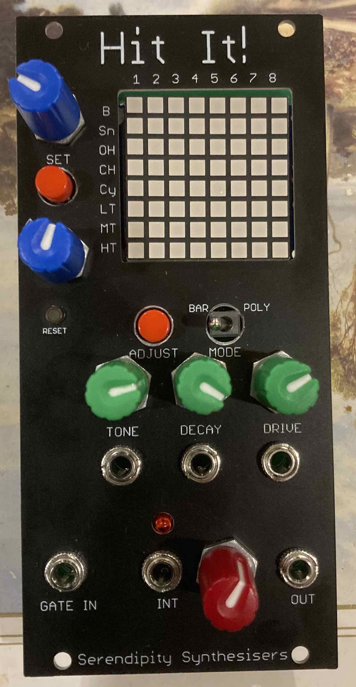
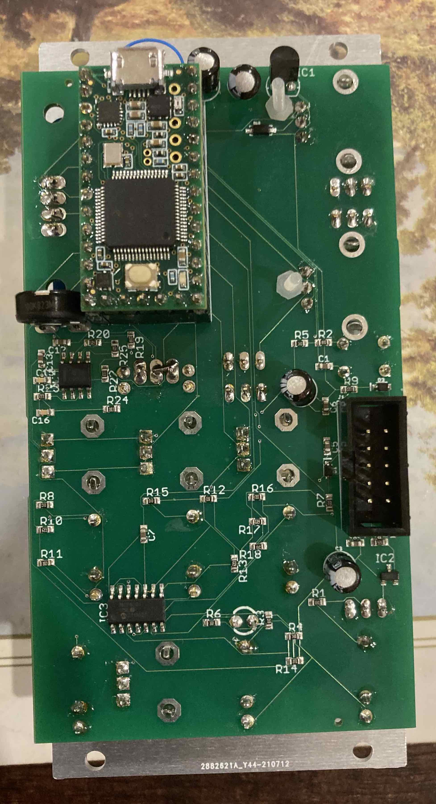
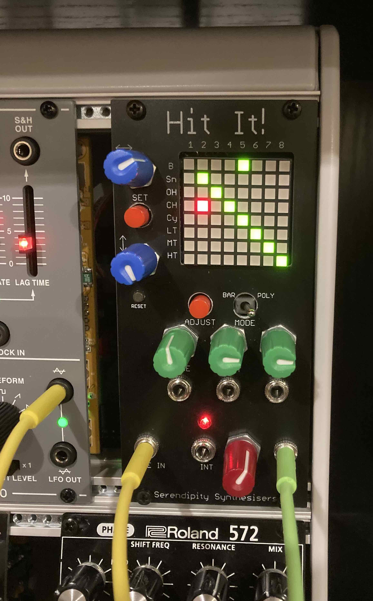

# EuroDrum
Firmware source and schematics for the "Hit It!" Eurorack module.

<table>
  <tr>
    <td></td>
    <td></td>
    <td></td>
  </tr>  
</table>

The two encoders on the left let you move a cursor around the LED matrix, and the SET button toggles a connection between a beat (along the top) and a drum sample (down the side).

In "Bar" mode, the bar length is up to 8 beats, and the lit LEDs connect a beat to the instruments to be played on that beat.
In "Poly" mode, the lit LEDs mean play the corresponding instrument once every *n* beats.

Tone controls a LP filter, increasing cutoff until 12 o'clock, then decreasing while adding resonance. Decay is a simple decay envelope, and drive adds waveshaper distortion. Each control has an associated CV input below.

For timing, there is external gate in, as well as an internally generated clock (that is normalled to the gate in), and of course the audio out.

Hitting adjust switches between control modes:

- Normal mode as shown in the images where the encoders and SET button make and break connections.
  - A long press of SET toggles between active and inactive states.
  - A very long press of SET enters barlength mode, where continuing to hold SET while turning the left-right encoder will adjust the bar length for BAR mode.
  - A long press of ADJUST will clear all connections.
  - Continuing to hold ADJUST will restore a default set of connections.
- Levels mode for setting the level of each instrument. A long press of ADJUST will restore the default levels.
- Kit mode for selecting between 7 kits.
  - Each instrument has an alternate sample
  - The pairs are Bass/Clap, Snare/Rimshot, Open-hat/Maracas, Closed-hat/Claves, Crash cymbal/Ride cymbal, Toms/Congas.
  - Access is by selecting one of 7 pre-defined combinations. This way the front markings keep a reasonable meaning when changing the allocation.
  - Cycle kits with the SET button when in this mode (the display will show a letter from A to G).
- Sequencer mode where the outputs are pitch CVs.
  - The CV offset range from -0.41V to +1V corresponding to 8 offsets from down a 4th to up an octave, following a pentatonic major or minor scale. 
  - The SET button switches between scales (a + on the display indicates major and - indicates minor).
  - A long press of adjust will enable and disable the sequencer mode.
